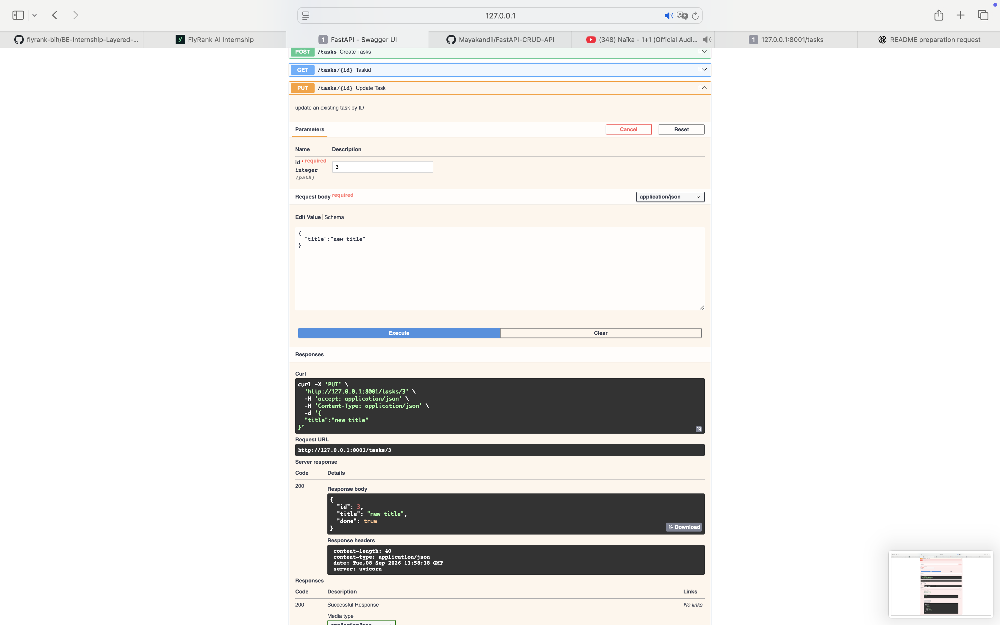

# FastAPI CRUD API

A simple Task Management REST API built with **FastAPI**.

This project demonstrates how to build a REST API with CRUD operations. It allows users to create, read, update, and delete tasks. The tasks are stored in memory using a Python list.

## Features

- Get all tasks
- Get a specific task by ID
- Create a new task
- Update an existing task
- Delete a task
- Health check endpoint
- Request validation and error handling
- Interactive Swagger UI documentation

## Installation

Install the required packages:

```bash
pip install fastapi uvicorn
```

## Run the API

From the project directory, run:

```bash
uvicorn main:app --reload --port 8001
```

The API will run at:

```text
http://127.0.0.1:8001
```

Interactive Swagger documentation is available at:

```text
http://127.0.0.1:8001/docs
```

## API Endpoints

| Method | Endpoint | Description |
|---|---|---|
| GET | `/` | Returns basic information about the Task API |
| GET | `/health` | Checks whether the API is running |
| GET | `/tasks` | Returns all tasks |
| GET | `/tasks/{id}` | Returns a specific task by ID |
| POST | `/tasks` | Creates a new task |
| PUT | `/tasks/{id}` | Updates the title and/or done status of a task |
| DELETE | `/tasks/{id}` | Deletes a task |

## Example Task

```json
{
  "id": 1,
  "title": "Learn FastAPI",
  "done": false
}
```

## Create a Task

Send a `POST` request to `/tasks` with a title:

```json
{
  "title": "Learn GitHub"
}
```

A successfully created task returns status code `201 Created`.

## Update a Task

Send a `PUT` request to `/tasks/{id}`.

The request body can contain `title`, `done`, or both:

```json
{
  "title": "Finish FastAPI project",
  "done": true
}
```

If the task does not exist, the API returns `404 Not Found`.

An empty or invalid request body returns `400 Bad Request`.

## Delete a Task

Send a `DELETE` request to `/tasks/{id}`.

A successful deletion returns:

```text
204 No Content
```

If the task ID does not exist, the API returns `404 Not Found`.

## curl Example

Command:

```bash
curl -i http://127.0.0.1:8001/tasks
```

Actual output:

```text
HTTP/1.1 200 OK
date: Tue, 08 Sep 2026 14:06:51 GMT
server: uvicorn
content-length: 148
content-type: application/json

[{"id":1,"title":"Learn FastAPI","done":false},{"id":2,"title":"Build CRUD API","done":false},{"id":3,"title":"Push project to GitHub","done":true}]
```

## Swagger UI

FastAPI automatically generates interactive API documentation using Swagger UI.

After starting the server, visit:

```text
http://127.0.0.1:8001/docs
```

The Swagger UI allows each endpoint to be tested directly using the **Try it out** button.

### Swagger Screenshot



> The Swagger screenshot should be saved in the repository as `swagger.png`.

## Error Handling

The API handles common errors using appropriate HTTP status codes:

| Status Code | Meaning |
|---|---|
| `200 OK` | Request completed successfully |
| `201 Created` | A new task was created successfully |
| `204 No Content` | A task was deleted successfully |
| `400 Bad Request` | The request body is empty or invalid |
| `404 Not Found` | The requested task does not exist |

## Technologies Used

- Python
- FastAPI
- Pydantic
- Uvicorn
- Swagger UI / OpenAPI

## Project Structure

```text
FastAPI-CRUD-API/
├── main.py
├── README.md
└── swagger.png
```

## Notes

Tasks are stored **in memory**, so changes are not permanent. If the server is restarted, the task list returns to the initial data defined in `main.py`.
